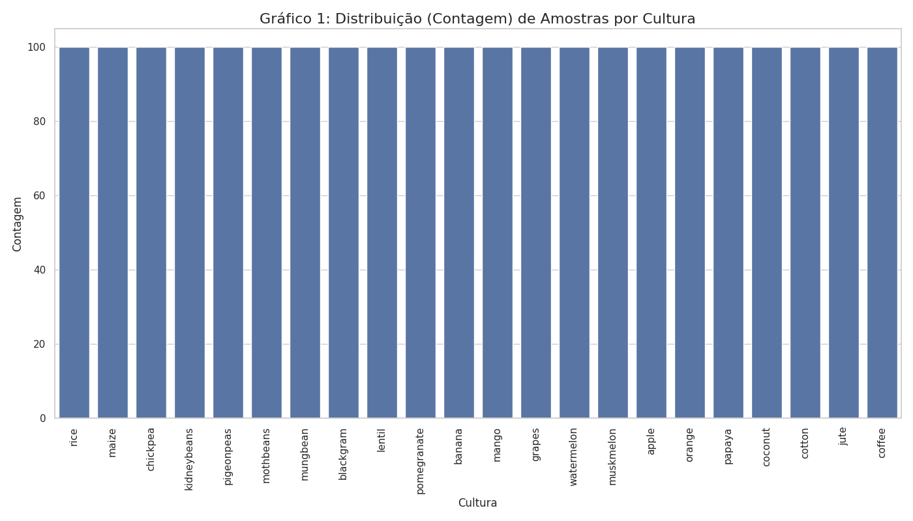
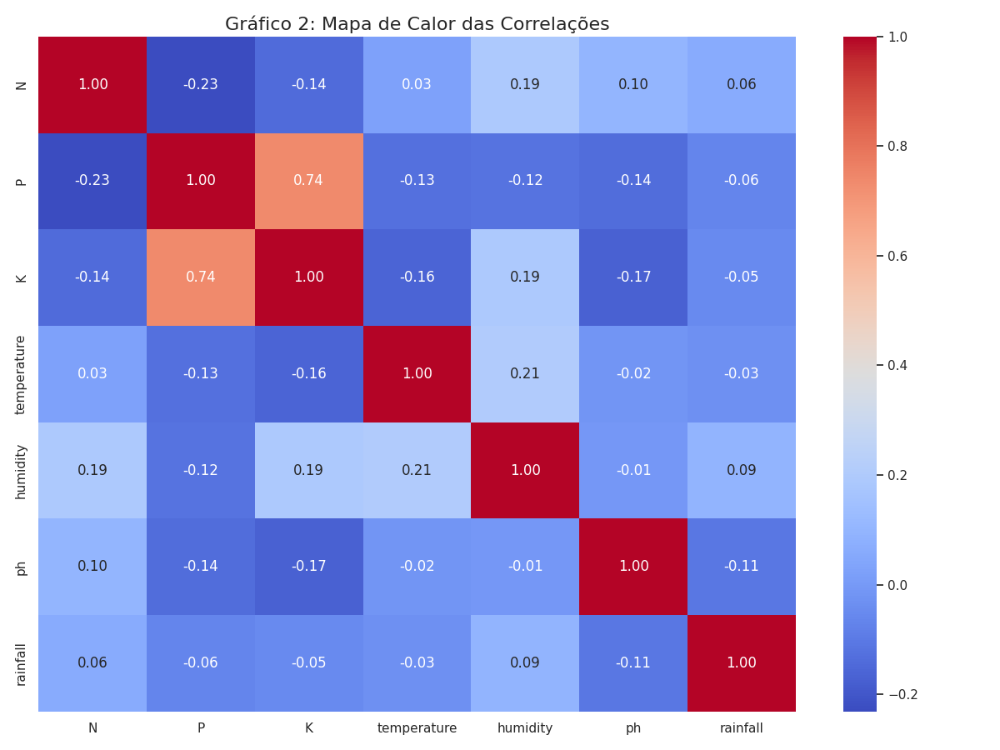
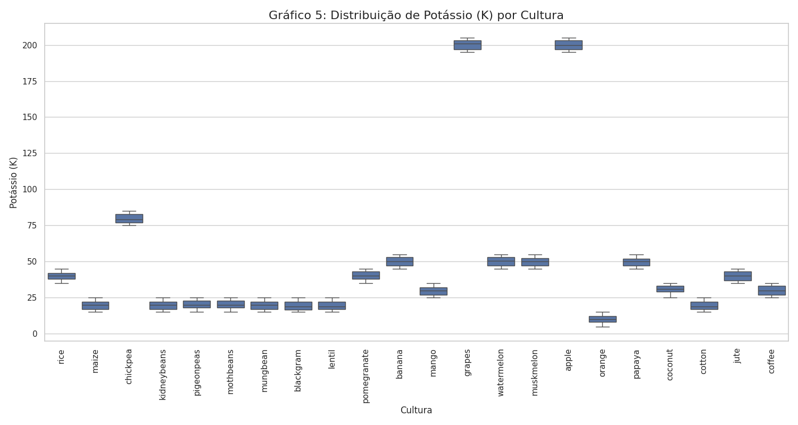

# FIAP - Faculdade de Informática e Administração Paulista

<p align="center">
<a href= "https://www.fiap.com.br/"></a>
</p>

<br>

# PBL FarmTech - Fase 3: Desafio "Ir Além"
## Opção 2: Machine Learning no Agronegócio

<p align="center">
<a href= "https://youtu.be/p-HQ42mkhLE">Vídeo de Apresentação no Youtube</a>
</p>

##  Grupo 13

## 👨‍🎓 Integrantes: 
- <a href="https://www.linkedin.com/in/amanda-damasceno-martins/">566598 - Amanda Damasceno Martins</a>
- <a href="https://www.linkedin.com/in/cauasantoslt">566599 - Cauã Santos</a>
- <a href="https://www.linkedin.com/in/fabio-baldo-7959a22a/">567851 - Fabio Baldo</a> 
- <a href="https://www.linkedin.com/in/giovanna-gomes-82b993372/">567169 - Giovanna Gomes Oliveira</a> 
- <a href="https://www.linkedin.com/in/roberto-alvares-785059215/">568265 - Roberto Almeida Alvares</a>

## 👩‍🏫 Professores:
### Tutor(a) 
- <a href="https://www.linkedin.com/in/sabrina-otoni-22525519b/">Sabrina Otoni</a>
### Coordenador(a)
- <a href="https://www.linkedin.com/in/andregodoichiovato/">André Godoi</a>


## 📜 Descrição
Este diretório contém os artefatos para o desafio "Ir Além" (Opção 2) do PBL da FarmTech. O objetivo foi analisar um dataset agrícola e construir um modelo de Machine Learning capaz de prever a cultura ideal com base em dados de solo e clima.

1. O Desafio
* O projeto consistiu em 5 etapas principais:
* Carregar o dataset produtos_agricolas.csv.
* Análise Exploratória (EDA) para entender os dados (mínimo de 5 gráficos).
* Identificar o "Perfil Ideal" de solo/clima para 3 culturas.
* Desenvolver 5 modelos preditivos com algoritmos distintos.
* Avaliar e comparar o desempenho dos modelos.

2. Análise Exploratória (EDA) - Descobertas
A análise visual dos dados (contida no notebook) foi crucial para entender o comportamento das 22 culturas. Os 5 gráficos principais estão na pasta assets/ e são resumidos abaixo:

##### Descoberta 1: Dataset Balanceado
O Gráfico 1 (Countplot) mostrou que o dataset era perfeitamente balanceado, com exatamente 100 amostras para cada uma das 22 culturas, o que é ideal para o treinamento.

##### Descoberta 2: O Fator Potássio (K)
O Gráfico 5 (Boxplot) revelou um perfil de solo único para apple (Maçã) e grapes (Uva). Elas exigem níveis de Potássio (K) 3 a 4 vezes maiores do que qualquer outra cultura.

##### Descoberta 3: O Fator Chuva (Rainfall)
O Gráfico 4 (Scatterplot) mostrou que as culturas formam "clusters" climáticos claros. O rice (Arroz) é o principal outlier, formando um grupo isolado que exige um volume de chuva (acima de 200mm) muito superior ao de todas as outras.

(Gráficos 2 (Heatmap) e 3 (pH) também estão disponíveis no notebook e na pasta assets)

3. Comparativo dos 5 Modelos Preditivos
Após o pré-processamento dos dados (LabelEncoding, StandardScaler e Train/Test Split), 5 algoritmos foram treinados e avaliados pela sua acurácia no conjunto de teste (440 amostras).

O Random Forest foi o grande campeão, provando ser uma ferramenta extremamente robusta para esta tarefa.

<p align="center">

</p>
<p align="center">

</p>
<p align="center">

</p>
<p align="center">

</p>

## 📁 Estrutura de pastas

```sh
└── PBL-FarmTech/
    ├── Fase1
    ├── Fase2
    └── Fase3
        ├── assets
        └── IrAlem
            ├── Dashboard em Python     
            └── Machine Learning no Agronegócio
                ├── assets
                │   └── Imagens dos Gráficos Usados.   
                ├── CauãSantos_RM566599_fase3_cap1.ipynb
                ├── produtos_agricolas.csv
                ├── Link_Youtube.txt 
                └── README_Ir_Alem2.md
```


## 🔧 Como executar o código

1. Certifique-se de que o arquivo produtos_agricolas.csv está na mesma pasta que o notebook.

2. Abra o notebook CauãSantos_RM566599_fase3_cap1.ipynb em um ambiente com Jupyter (como VS Code, Jupyter Lab ou Google Colab).

3. Execute as células na ordem.

4. Bibliotecas necessárias: pandas, matplotlib, seaborn, scikit-learn (sklearn).
## 🗃 Histórico de lançamentos

* 0.3.0 - 12/11/2025
    * Ir Além 2 Machine Learnin no Agronegócio.

## 📋 Licença

<p xmlns:cc="http://creativecommons.org/ns#" xmlns:dct="http://purl.org/dc/terms/"><a property="dct:title" rel="cc:attributionURL" href="https://github.com/agodoi/template">MODELO GIT FIAP</a> por <a rel="cc:attributionURL dct:creator" property="cc:attributionName" href="https://fiap.com.br">Fiap</a> está licenciado sobre <a href="http://creativecommons.org/licenses/by/4.0/?ref=chooser-v1" target="_blank" rel="license noopener noreferrer" style="display:inline-block;">Attribution 4.0 International</a>.</p>


