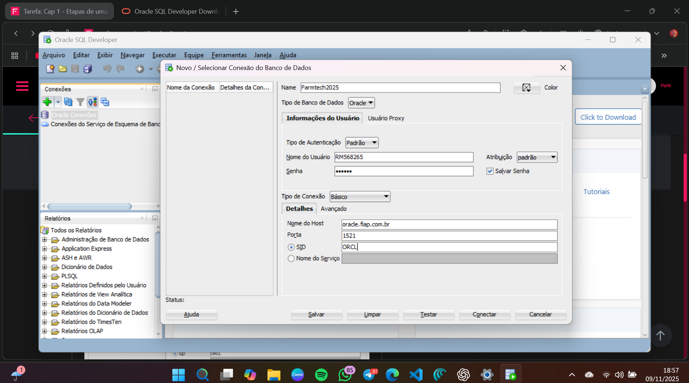
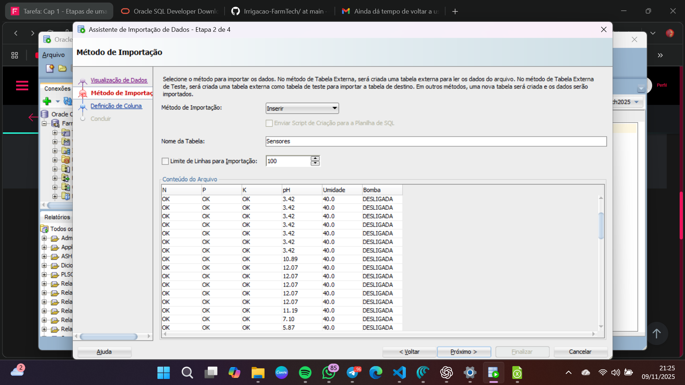
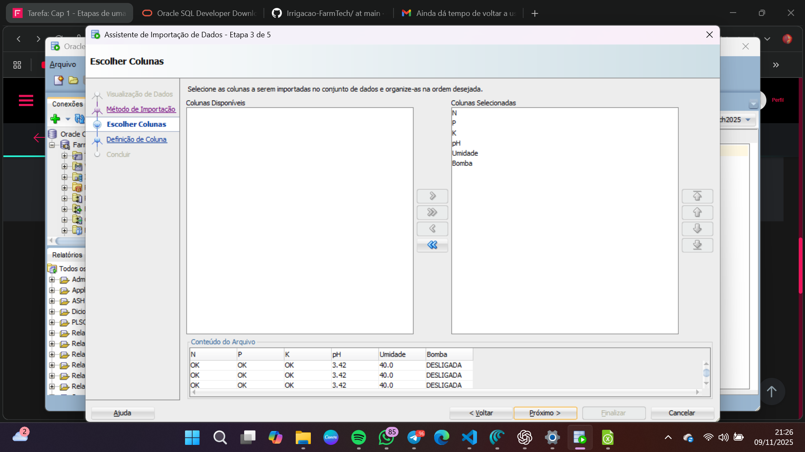
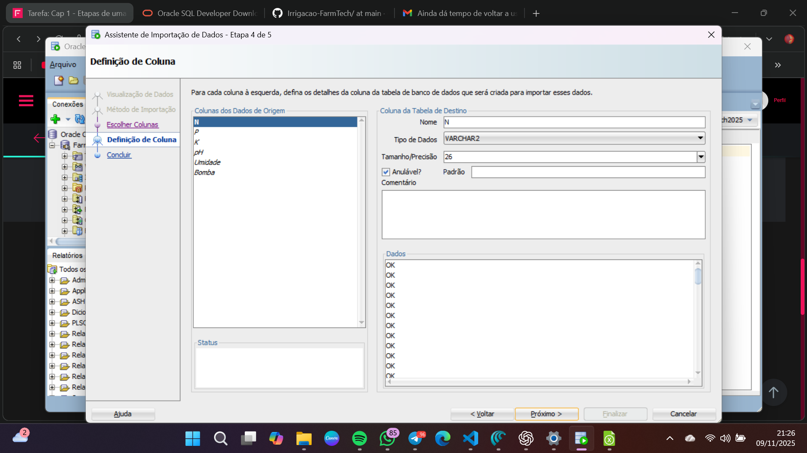
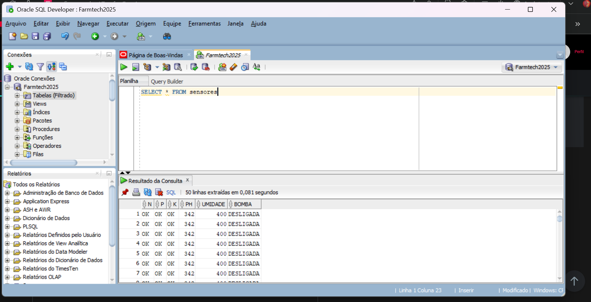

# FIAP - Faculdade de Informática e Administração Paulista

<p align="center">
<a href= "https://www.fiap.com.br/"></a>
</p>

<br>

# Etapas de uma Máquina Agrícola

<p align="center">
<a href= "">Vídeo de Apresentação no Youtube</a>
</p>

##  Grupo 13

## 👨‍🎓 Integrantes: 
- <a href="https://www.linkedin.com/in/amanda-damasceno-martins/">566598 - Amanda Damasceno Martins</a>
- <a href="https://www.linkedin.com/in/cauasantoslt">566599 - Cauã Santos</a>
- <a href="https://www.linkedin.com/in/fabio-baldo-7959a22a/">567851 - Fabio Baldo</a> 
- <a href="https://www.linkedin.com/in/giovanna-gomes-82b993372/">567169 - Giovanna Gomes Oliveira</a> 
- <a href="https://www.linkedin.com/in/roberto-alvares-785059215/">568265 - Roberto Almeida Alvares</a>

## 👩‍🏫 Professores:
### Tutor(a) 
- <a href="https://www.linkedin.com/in/sabrina-otoni-22525519b/">Sabrina Otoni</a>
### Coordenador(a)
- <a href="https://www.linkedin.com/in/andregodoichiovato/">André Godoi</a>


## 📜 Descrição

Este projeto documenta a **Entrega Obrigatória da Fase 3 do PBL** (FarmTech Solutions), focada na introdução a Banco de Dados. O objetivo foi carregar os dados de sensores, gerados na Fase 2, em um banco de dados relacional Oracle.

### Etapa 1: Geração dos Dados (Fase 2)

O primeiro passo foi utilizar o código C++ (ou Python) da Fase 2 para gerar os dados simulados dos sensores (N, P, K, pH, Umidade, Bomba). A saída do monitor serial foi salva no formato CSV no arquivo `Sensores_Fazenda.csv`, que serviu como base para a importação.

### Etapa 2: Conexão com Oracle SQL Developer

Utilizamos o Oracle SQL Developer para estabelecer a conexão com o banco de dados da FIAP, utilizando as credenciais fornecidas (RM, data de nascimento), o Hostname (`oracle.fiap.com.br`) e o SID (`ORCL`).

O teste de conexão foi bem-sucedido, como mostra o print abaixo:

<p align="center">
  
</p>

### Etapa 3: Importação dos Dados (Assistente de Importação)

Com a conexão ativa, clicamos com o botão direito em "Tabelas" e selecionamos "Importar Dados", carregando o arquivo `Sensores_Fazenda.csv`.

O assistente de importação (wizard) nos guiou pela definição do nome da tabela (ex: `SENSORES_FAZENDA_G13`) e pelo mapeamento das colunas (N, P, K, pH, etc.).

<p align="center">
  
</p>
<p align="center">
  
</p>
<p align="center">
  
</p>


### Etapa 4: Validação e Consulta (SELECT)

Após a conclusão da importação, para validar que todos os dados foram carregados corretamente no banco da Oracle, executamos uma consulta `SELECT *` na tabela recém-criada.

O resultado (visível abaixo) confirma que as linhas do nosso CSV agora são registros permanentes no banco de dados.

<p align="center">
  
</p>


# **Programa "Ir Além":**
  Esta seção contém os desafios opcionais de Data Science e Data Visualization.
  * **[Opção 1: Dashboard em Python](/Fase3/IrAlem/Dashboard%20em%20Python)**
    * **Foco:** Data Visualization.
    * **Descrição:** Desenvolvimento de um dashboard interativo (Streamlit/Dash) para visualizar os dados dos sensores da Fase 2 em tempo real.

  * **[Opção 2: Machine Learning no Agronegócio](/Fase3/IrAlem/Machine%20Learning%20no%20Agronegócio/)**
    * **Foco:** Ciência de Dados.
    * **Descrição:** Projeto completo de Data Science, incluindo Análise Exploratória (EDA) e o desenvolvimento de 5 modelos preditivos para recomendação de culturas. O modelo **Random Forest** foi o campeão, atingindo **99.32% de acurácia**.


## 📁 Estrutura de pastas

```sh
└── PBL-FarmTech/
    ├── Fase1
    ├── Fase2
    ├── Fase3
    │   ├── assets
    │   │   └── README.md
    │   │   
    │   ├── IrAlem
    │   │   ├── Dashboard em Python
    │   │   │   └── app.py
    │   │   │
    │   │   └── Machine Learning no Agronegócio
    │   │       ├── assets
    │   │       ├── CauãSantos_RM566599_fase3_cap1.ipynb
    │   │       ├── Link_Youtube.txt
    │   │       ├── produtos_agricolas.csv 
    │   │       └── README_Ir_Alem2.md
    │   │   
    │   └── README.md
    │
    ├── Dashboard em Python
    └── README.md
```


## 🔧 Como executar o código

## 🗃 Histórico de lançamentos

* 0.3.0 - 12/11/2024
    * FASE 3: Banco de Dados Estruturado (CDS)
* 0.2.0 - 15/10/2025
    * FASE 2: IoT e Automação Inteligente (AICSS)
* 0.1.0 - 19/09/2025
    * FASE 1: Base de Dados Inicial (Python)

## 📋 Licença

<p xmlns:cc="http://creativecommons.org/ns#" xmlns:dct="http://purl.org/dc/terms/"><a property="dct:title" rel="cc:attributionURL" href="https://github.com/agodoi/template">MODELO GIT FIAP</a> por <a rel="cc:attributionURL dct:creator" property="cc:attributionName" href="https://fiap.com.br">Fiap</a> está licenciado sobre <a href="http://creativecommons.org/licenses/by/4.0/?ref=chooser-v1" target="_blank" rel="license noopener noreferrer" style="display:inline-block;">Attribution 4.0 International</a>.</p>


