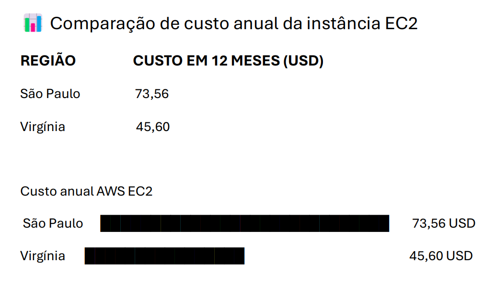

# FIAP - Faculdade de Informática e Administração Paulista

<p align="center">
<a href= "https://www.fiap.com.br/"></a>
</p>

<br>

# FarmTech Solutions - Fase 5: Machine Learning e Computação em Nuvem

<p align="center">
<a href="https://youtu.be/_kYvgVWzsQA">🎥 Vídeo 1: Apresentação do Modelo de Machine Learning</a> &nbsp; | &nbsp;
<a href="https://youtu.be/zvK2uSWqMio">☁️ Vídeo 2: Justificativa e Custos AWS</a> &nbsp; | &nbsp;
<a href="LINK_IR_ALEM_AQUI">🤖 Vídeo 3: Projeto Ir Além (IoT)</a>
</p>

## Grupo 25

## 👨‍🎓 Integrantes: 
- <a href="https://www.linkedin.com/in/amanda-damasceno-martins/">566598 - Amanda Damasceno Martins</a>
- <a href="https://www.linkedin.com/in/cauasantoslt">566599 - Cauã Santos</a>
- <a href="https://www.linkedin.com/in/fabio-baldo-7959a22a/">567851 - Fabio Baldo</a> 
- <a href="https://www.linkedin.com/in/giovanna-gomes-82b993372/">567169 - Giovanna Gomes Oliveira</a> 

## 👩‍🏫 Professores:
### Tutor(a) 
- <a href="https://www.linkedin.com/in/sabrina-otoni-22525519b/">Sabrina Otoni</a>
### Coordenador(a)
- <a href="https://www.linkedin.com/in/andregodoichiovato/">André Godoi</a>

---

## 📜 Descrição do Projeto

Nesta Fase 5, avançamos na infraestrutura de dados da **FarmTech Solutions**, integrando modelagem preditiva avançada e planejamento de arquitetura em nuvem. O projeto é dividido em duas frentes principais de atuação:

1. **Ciência de Dados e Machine Learning (Entrega 1):** Realizamos uma análise exploratória (EDA) sobre uma base de dados climáticos e de safra de uma fazenda de 200 hectares. Aplicamos **Machine Learning Não Supervisionado (K-Means)** para encontrar tendências e agrupamentos nas plantações. Em seguida, desenvolvemos e comparamos **5 modelos de Regressão Supervisionada** (Árvore de Decisão, Random Forest, KNN, SVR e Gradient Boosting) para prever o rendimento das safras. Toda a análise, código, limpeza de dados e conclusões sobre as limitações dos modelos estão documentados no nosso Jupyter Notebook.

2. **Arquitetura em Nuvem - AWS (Entrega 2):** Planejamento da infraestrutura para hospedar a nossa API e o modelo de Machine Learning. Realizamos o dimensionamento e cotação de servidores Linux na AWS, balanceando custos, latência e conformidade com leis de proteção de dados.

### 🚀 Programa "Ir Além" (Opção 1)
Implementamos o **Sistema de Coleta e Comunicação de Dados Usando ESP32 Integrado ao Wi-Fi**.
* **Hardware:** Utilização de um microcontrolador ESP32 conectado a sensores agrícolas para leitura de condições do ambiente físico em tempo real.
* **Comunicação:** Os dados lidos são transmitidos via Wi-Fi para um serviço de armazenamento/visualização, fechando o ciclo da Internet das Coisas (IoT) na nossa fazenda inteligente.

---

## ☁️ Análise e Estimativa de Custos na AWS (Entrega 2)

Para hospedar o ecossistema da FarmTech Solutions, configuramos uma máquina na Calculadora AWS com as seguintes especificações: **Linux (100% On-Demand), 2 CPUs, 1 GiB de memória RAM, 5 Gigabit de rede e 50 GB de armazenamento (HD)**.

Comparamos os custos entre duas regiões: **São Paulo (sa-east-1)** e **Virgínia do Norte (us-east-1)**.
<p align="center">

</p>

### 📌 Justificativa Técnica e Decisão de Região
Apesar da região da Virgínia do Norte (EUA) apresentar, historicamente, um custo mensal em dólares inferior ao de São Paulo, a nossa decisão arquitetônica para a FarmTech Solutions é **hospedar a infraestrutura na região de São Paulo (BR)**. Os motivos são:

1. **Tempo de Resposta (Latência):** O sistema depende de acesso ultra-rápido aos dados dos sensores espalhados pela fazenda para automatizar a irrigação em tempo real. Manter os servidores no Brasil reduz drasticamente a latência de rede em comparação com o tráfego internacional.
2. **Restrições Legais e Soberania de Dados:** Como lidamos com dados sensíveis de produção agrícola e, possivelmente, dados de parceiros comerciais, o armazenamento em território nacional garante o cumprimento integral da legislação brasileira (como o Marco Civil da Internet e a LGPD), evitando atritos jurídicos relacionados ao trânsito internacional de dados.

O custo ligeiramente superior no Brasil é compensado pela segurança jurídica e pela performance operacional crítica para o agronegócio.

---

## 📁 Estrutura de pastas

```sh
└── PBL-FarmTech/
    ├── Fase1
    ├── Fase2
    ├── Fase3
    ├── Fase4
    ├── Fase5
    │   ├── assets
    │   │   ├── logo-fiap.png
    │   │   └── comparativo_aws.png
    │   │   
    │   ├── IrAlem
    │   │   └── Coleta_Dados_ESP32
    │   │       ├── main.cpp
    │   │       ├── arquitetura_wokwi.png
    │   │       └── README_IrAlem.md
    │   │  
    │   ├── CauaSantos_rm566599_pbl_fase5.ipynb
    │   ├── crop_yield.csv
    │   └── README.md
    │
    └── README.md
```

### 🔧 Como executar o código
Para rodar a Análise de Dados localmente, siga os passos abaixo:

1. Pré-requisitos
Certifique-se de ter o Python instalado e instale as bibliotecas de Data Science:

```python 
pip install pandas numpy scikit-learn matplotlib seaborn jupyter
```
2. Executar o Jupyter Notebook
No terminal, navegue até a pasta Fase5 e inicie o ambiente do Jupyter:

```python
jupyter notebook
```
No navegador que se abrirá, clique no arquivo CauaSantos_rm566599_pbl_fase4.ipynb.

3. Reproduzir as Análises
Com o notebook aberto, você pode executar as células sequencialmente (Shift + Enter). Certifique-se de que o arquivo `crop_yield.csv` esteja no mesmo diretório do notebook para que o Pandas consiga carregar a base de dados corretamente.


## 🗃 Histórico de lançamentos
* 0.5.0 - 10/03/2026
    * FASE 5: Machine Learning (Clusterização e Regressão) e Planejamento de Custos na Nuvem (AWS).

* 0.4.0 - 26/11/2025
    * FASE 4: Machine Learning (Regressão), Dashboard Streamlit e Integração IoT/Oracle.

* 0.3.0 - 12/11/2025
    * FASE 3: Banco de Dados Estruturado (CDS)

* 0.2.0 - 15/10/2025
    * FASE 2: IoT e Automação Inteligente (AICSS)

* 0.1.0 - 19/09/2025
    * FASE 1: Base de Dados Inicial (Python)

## 📋 Licença

<p xmlns:cc="http://creativecommons.org/ns#" xmlns:dct="http://purl.org/dc/terms/"><a property="dct:title" rel="cc:attributionURL" href="https://github.com/agodoi/template">MODELO GIT FIAP</a> por <a rel="cc:attributionURL dct:creator" property="cc:attributionName" href="https://fiap.com.br">Fiap</a> está licenciado sobre <a href="http://creativecommons.org/licenses/by/4.0/?ref=chooser-v1" target="_blank" rel="license noopener noreferrer" style="display:inline-block;">Attribution 4.0 International</a>.</p>
